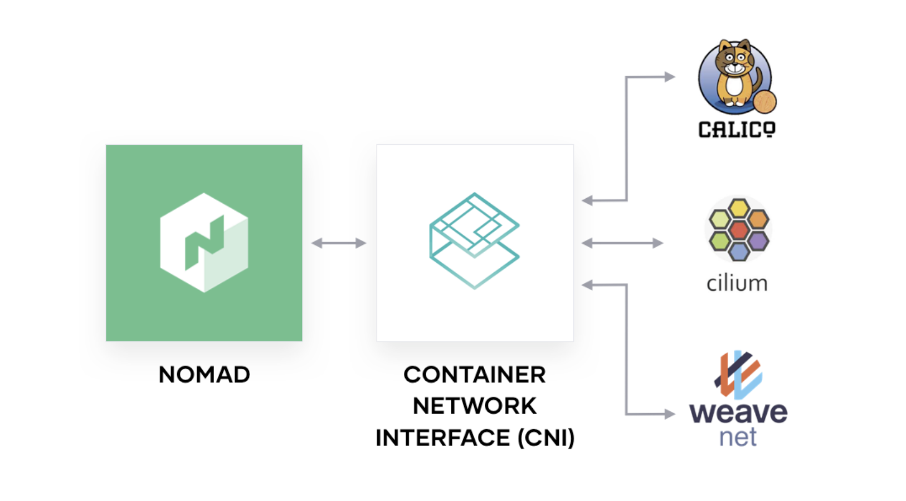
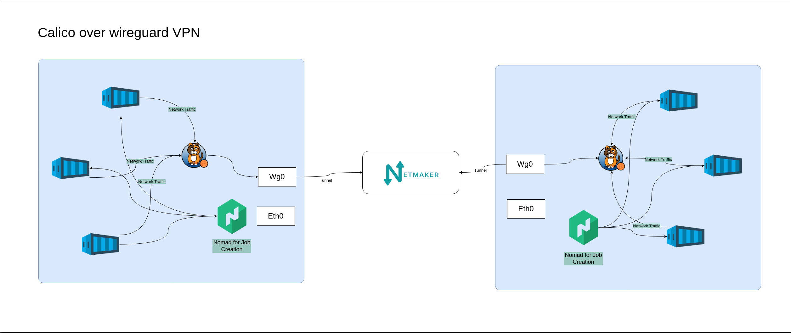

# Calico-Nomad

Author: [Aman Singh](https://github.com/amansinghtech)

Reference: <https://www.hashicorp.com/blog/multi-interface-networking-and-cni-plugins-in-nomad-0-12>

## Overview

Nomad supports multi-interface networking and CNI plugins. This allows you to configure multiple network interfaces for a task. Calico is a CNI plugin that provides networking and network policy for containers, virtual machines, and native host-based workloads.

This write-up is written to demonstrate how to use Calico as a CNI plugin for Nomad as an answer to this [problem statement](https://github.com/hashicorp/nomad/issues/11748).

Calico can be used as a CNI plugin for Nomad. This guide will walk you through the steps required to set up a Nomad cluster with Calico networking.

**Follow the full [guide here.](docs/main.md)**

**For Automated Setup Follow: [this guide](https://github.com/nekione/calico-nomad/blob/main/docs/main.md#automated-installation)**

## Calico-Nomad over Wireguard VPN

Wireguard is a fast, modern, secure VPN tunnel. Wireguard is a layer 3 tunnel that can be used to create a secure network between hosts (peer-to-peer).

### Problem Statement

We want to create a secure network between two hosts using Wireguard. We want to run a Nomad job on one of the hosts and access it from the other host. We want to use Calico as a CNI plugin for Nomad.

### what we have achieved?

We are able to run a Nomad job on one of the hosts and access it from the other host in the same network. We are able to use Calico as a CNI plugin for Nomad.

### where we are stuck?

When we try to access the Nomad job from the other host via the Wireguard tunnel, we are not able to access it. although we are able to ping the host from the other host. containers within the same host are able to access each other.

For wireguard, we are using netmaker. refer to this [guide](https://github.com/gravitl/netmaker)

I assume that the problem is with the calico configuration. I am not sure how to configure calico to work with vpn interface.
